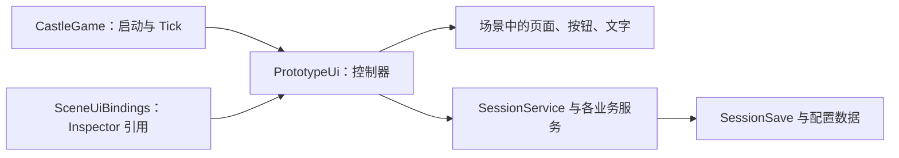

# 手工 UI 对象树与绑定清单

适用版本：分支 `根据策划案修订的版本`，核对基线 `910d350`，2026-10-07。

依据：用户提供的《程序说明文档.pdf》第 5～7 章，以及当前 `Assets/Castle/Scripts/V2/UI` 实现。PDF 是功能依据；下面的对象名、绑定字段和新增脚本是本次提出的实现方案，不是 PDF 原文，也不是已经完成的代码。

配套阅读：[手工UI迁移修改对照表.md](手工UI迁移修改对照表.md)。本文只说明搭建与绑定，不修改现有游戏逻辑。

## 1. 先理解需要改什么

目前 `CastleGame.Awake()` 创建 `SessionService`，再创建普通 C# 对象 `PrototypeUi`。后者通过 `UiFactory` 创建 Canvas、文字、按钮等。`Page()` 每次切页都会销毁旧页面并实例化新页面，然后继续追加子物体。现有 10 个页面 prefab 基本是带 `PrototypePanel` 的空壳。

因此，**仅把 Button 放进场景，或者给现有 prefab 添加子物体，并不能完成接管**：旧代码仍会生成另一套 UI，并可能销毁手工页面。必须同时改创建入口、页面切换和各页面绘制函数。

本方案采用：**场景保存固定 UI → 一个绑定组件保存引用 → 原控制器连接按钮与业务服务**。不要求给每一个按钮写独立脚本。



## 2. 哪些脚本能挂，挂在哪里

| 脚本/类型 | 当前是否存在 | 挂载位置 | 职责与绑定方式 |
|---|---|---|---|
| `CastleGame` | 已有 MonoBehaviour | `Castle Game` | 保留 `Settings`、`Content`；新增 `UiBindings` 字段，拖入下方的绑定组件；仍负责创建 Session、调用 UI Tick、自动存档 |
| `SceneUiBindings` | **需要新增** MonoBehaviour | `Castle Game/Canvas` | 保存本文定义的全部页面、控件和列表模板引用；只保存引用、检查缺项，不创建 Session |
| `UiItemView` | **需要新增** MonoBehaviour | 每一个重复项模板的根物体 | 保存该条目的文字、图片、按钮、拖放组件引用；由控制器填充数据和设置回调 |
| `LinkHandler` | 已有 MonoBehaviour | `DialoguePage/.../DialogueText` | 检测 TMP `<link>` 点击；`Click` 是 C# 委托，必须通过代码赋值，不能在 Inspector 配置 |
| `DragToken` | 已有 MonoBehaviour | 可拖的时间线卡、已填槽位/路径标签根物体 | 填写运行时 `Value`、`Slot`；拖拽结束寻找 DropZone；预先添加 CanvasGroup |
| `DropZone` | 已有 MonoBehaviour | 时间线槽位和人物路径地图节点根物体 | `Drop` 是 C# 委托，由控制器赋值；不是 Inspector 的 OnDrop 事件 |
| `PrototypePanel` | 已有 MonoBehaviour | 可留在页面根物体，也可移除 | 只提供 `Content` RectTransform；不管理显示、按钮或数据。本方案不依赖它 |
| `PrototypeUi`、`UiFactory` | 已有普通 C# 类 | **不挂到物体上** | 前者继续当控制器；后者退出固定 UI 创建流程 |
| `SessionService`、各 Gameplay Service、SaveService | 已有普通 C# 类 | **不挂到物体上** | 保留业务和存档行为，按钮经控制器调用它们 |
| `GameSettings`、`ContentDatabase`、各 Config/Binding | 已有 ScriptableObject | **不 Add Component** | 引用现有 `.asset` 资源；`HotspotBinding` 也是配置资产，不是热点按钮组件 |

**本次只新增文档，`SceneUiBindings` 和 `UiItemView` 尚未写入项目。** 先按配套表实现脚本字段，再在 Inspector 拖引用。不要搜索旧版本已移除的脚本来绑定。

## 3. 层级标记和通用组件

以下树中，所有 UI 物体都有 `RectTransform`；Unity 自动附带的 `CanvasRenderer` 不逐项列出。

| 标记 | 需要的组件及子物体 | 配置 |
|---|---|---|
| `[Group]` | RectTransform | 只负责分组，不强制加 Image |
| `[Text]` | TextMeshProUGUI | 字体用 `Assets/Castle/Resources/Castle/ChineseTMP.asset`；一般关闭 Raycast Target |
| `[Button]` | Image + Button；子物体 `Label [Text]` | Button.Target Graphic 指向本体 Image；On Click 留空，由控制器绑定 |
| `[ArtButton]` | RawImage + Button；子物体 `Label [Text]` | 使用 Texture2D 按钮图；Target Graphic 指向 RawImage |
| `[Picture]` | RawImage | 用于 Texture2D 背景/插图；关闭 Raycast Target |
| `[Sprite]` | Image | 用于 Sprite 头像；Preserve Aspect，关闭 Raycast Target |
| `[Scroll]` | ScrollRect；子 `Viewport [Image + RectMask2D]`，再子 `Content [Group]` | ScrollRect.viewport/content 显式绑定；垂直滚动、Clamped；Content 顶部锚定 |
| `[Slider]` | Slider；子 Background(Image)、HandleSlideArea/Handle(Image) | Handle Rect 指向 Handle；Target Graphic 指向 Handle Image；横向；On Value Changed 留空 |
| `[ItemHost]` | RectTransform | 数据项父节点；可用 VerticalLayoutGroup + ContentSizeFitter(垂直 Preferred Size) |
| `[Wave]` | Group，下放 90 个 Image 条形子物体 | 所有条形关闭 Raycast Target；把 RectTransform 数组绑定给控制器；播放页与结局各一套 |

Scroll 列表二选一：用 LayoutGroup/ContentSizeFitter 自动布局，或保留代码计算子项位置和 Content 高度。**不要让布局组件与旧的 sizeDelta/anchoredPosition 写入同时控制同一对象。** 对白和回放正文若保留当前按 preferredHeight 调整高度，就不要再给正文 Content 加冲突的布局组件。

## 4. 完整场景对象树

建议直接改现有 `Assets/Castle/Scenes/CastlePrototype.unity`，保留原 Camera 和 `Castle Game`。下列名称是建议名称；程序应依赖显式引用，不依赖名称查找。`*` 表示按数据生成/复用的重复项，详见第 7 节。

```text
CastlePrototype
├─ Main Camera                         [沿用 Camera、AudioListener 和现有渲染配置]
├─ EventSystem                         [EventSystem + StandaloneInputModule；场景只留一个]
└─ Castle Game                         [CastleGame + AudioSource]
   └─ Canvas                           [Canvas + CanvasScaler + GraphicRaycaster + 新增 SceneUiBindings]
      ├─ Letterbox                     [Image，全屏底色，Raycast Target 关闭]
      └─ Stage                         [Group，居中，1600×900]
         ├─ PagesRoot                  [Group]
         │  ├─ TitlePage               [Group]
         │  │  ├─ Background           [Picture]
         │  │  ├─ GameTitle            [Text]
         │  │  ├─ BeginButton          [ArtButton]
         │  │  ├─ ContinueButton       [ArtButton]
         │  │  ├─ SettingsButton       [ArtButton]
         │  │  ├─ CreditsButton        [ArtButton]
         │  │  ├─ ExitButton           [ArtButton]
         │  │  └─ Footer               [Text]
         │  ├─ OutsidePage             [Group]
         │  │  ├─ Background           [Picture]
         │  │  └─ ReadInvitationButton [Button]
         │  ├─ InvitationPage          [Group]
         │  │  ├─ InvitationImage      [Picture]
         │  │  └─ CollectButton        [Button]
         │  ├─ CollectedPage           [Group]
         │  │  ├─ CollectedImage       [Picture]
         │  │  └─ EnterCastleButton    [Button]
         │  ├─ RoomPage                [Group]
         │  │  ├─ Background           [Picture]
         │  │  ├─ HotspotRoot          [ItemHost，或放手工热点按钮]
         │  │  │  └─ HotspotItem*      [Button + UiItemView]
         │  │  ├─ TravelButton         [Button]
         │  │  ├─ PuzzlesButton        [Button]
         │  │  └─ HistoryButton        [Button]
         │  ├─ DialoguePage            [Group]
         │  │  ├─ Background           [Picture]
         │  │  ├─ DialoguePanel        [Image]
         │  │  │  ├─ SpeakerText       [Text]
         │  │  │  ├─ DialogueScroll    [Scroll]
         │  │  │  │  └─ Viewport/Content/DialogueText [Text + LinkHandler，开启 Raycast Target]
         │  │  │  └─ ContinueButton    [Button]
         │  │  ├─ TutorialPlayerButton[Button，仅磁带引导时显示]
         │  │  └─ EndingRoot           [Group，仅结局时显示]
         │  │     ├─ WaveBars          [Wave]
         │  │     ├─ ConnectedLine     [Image]
         │  │     ├─ Cursor            [Image]
         │  │     ├─ SummaryText       [Text]
         │  │     └─ SkipButton        [Button]
         │  ├─ MapPage                 [Group，同时承载地图及无地图时的房间列表]
         │  │  ├─ MapVisualRoot        [Group]
         │  │  │  ├─ FloorTabs         [ItemHost → Button + UiItemView *]
         │  │  │  ├─ MapImage          [Picture]
         │  │  │  ├─ NodeRoot          [Group → 地图节点 Button + UiItemView *]
         │  │  │  ├─ Legend           [Text，三种房间状态]
         │  │  │  ├─ LocationTimeText  [Text]
         │  │  │  └─ CloseButton       [Button]
         │  │  └─ TravelListRoot       [Group]
         │  │     ├─ RoomScroll        [Scroll → Content 内 RoomItem *]
         │  │     └─ TravelHint        [Text]
         │  ├─ RecordsPage             [Group]
         │  │  ├─ WorkbenchTabs        [4 个 Button：档案、锚点校时、空间事件、调查册]
         │  │  ├─ DeviceStatusRoot     [ItemHost → UiItemView *]
         │  │  ├─ RecordScroll         [Scroll → Content 内录音 Button + UiItemView *]
         │  │  ├─ EmptyText            [Text]
         │  │  ├─ HintText             [Text]
         │  │  └─ LeaveControlButton   [Button]
         │  ├─ TapesPage               [Group]
         │  │  ├─ TapeScroll           [Scroll → Content 内磁带 Button + UiItemView *]
         │  │  └─ EmptyText            [Text]
         │  ├─ PlaybackPage            [Group]
         │  │  ├─ RecordInfoText       [Text]
         │  │  ├─ TranscriptScroll     [Scroll → Viewport/Content/TranscriptText(Text)]
         │  │  ├─ ClockText            [Text]
         │  │  ├─ WaveBars             [Wave]
         │  │  ├─ SeekSlider           [Slider，范围由录音时长设置]
         │  │  ├─ PlayPauseButton      [Button]
         │  │  ├─ MarkButton           [Button]
         │  │  ├─ ExtractButton        [Button]
         │  │  ├─ BurnButton           [Button，仅中央档案播放入口显示]
         │  │  └─ AnalysisButton       [Button]
         │  ├─ JournalPage             [Group，同时承载调查册及对话历史]
         │  │  ├─ Background           [Picture]
         │  │  ├─ CategoryTabs         [5 个 Button：道具、线索、人物、已验证事件、对话记录]
         │  │  ├─ EntryScroll          [Scroll → Content 内条目/人物卡/历史项 *]
         │  │  ├─ InvitationCard       [Group：Picture + ReadButton(Button)，按获得状态显示]
         │  │  └─ EmptyText            [Text]
         │  ├─ PuzzlesPage             [Group：全部推理/音频分析/空间事件分析共用]
         │  │  └─ PuzzleScroll         [Scroll → Content 内 PuzzleItem *]
         │  └─ PuzzlePage              [Group]
         │     ├─ InstructionText      [Text]
         │     ├─ ChoiceRoot           [Group：anchor / location / conclusion]
         │     │  └─ OptionScroll      [Scroll → Content 内选项 Button + UiItemView *]
         │     ├─ CalibrationRoot      [Group：calibrate]
         │     │  ├─ TargetDeviceText  [Text]
         │     │  ├─ ReferenceRoot     [ItemHost → 参照设备 Button + UiItemView *]
         │     │  ├─ AnchorRoot        [ItemHost → 声响 Button + UiItemView *]
         │     │  ├─ ShiftSlider       [Slider，-600 到 600 秒]
         │     │  ├─ ShiftText         [Text]
         │     │  ├─ AlignedTimeText   [Text]
         │     │  ├─ ReferenceTrack    [Image + 子 ReferenceMarker(Image)]
         │     │  └─ TargetTrack       [Image + 子 TargetMarker(Image)]
         │     ├─ SlotsRoot            [Group：person_path / timeline 共用槽位条]
         │     │  └─ SlotItem*         [Button + UiItemView + CanvasGroup + DragToken + DropZone]
         │     │     ├─ Label          [Text]
         │     │     └─ StaticWave     [Group：20 个 Image，时间线槽位使用]
         │     ├─ PathRoot             [Group：person_path]
         │     │  ├─ FloorButton       [Button]
         │     │  ├─ MapImage          [Picture]
         │     │  ├─ Connections       [Group → 连接线 Image/RawImage *，不接收射线]
         │     │  └─ NodeRoot          [Group → Button + UiItemView + DropZone *]
         │     ├─ TimelineRoot         [Group：timeline]
         │     │  └─ CardScroll        [Scroll → Content 内 Button + UiItemView + CanvasGroup + DragToken *]
         │     ├─ FeedbackText         [Text]
         │     ├─ SubmitButton         [Button]
         │     └─ JournalButton        [Button]
         ├─ Chrome                    [Group：所有页面共用，不随页面销毁]
         │  ├─ Header                 [Image]
         │  │  ├─ TitleText           [Text]
         │  │  ├─ BackButton          [Button]
         │  │  ├─ MapButton           [Button]
         │  │  ├─ JournalButton       [Button]
         │  │  └─ SettingsButton      [Button]
         │  └─ StatusText             [Text：世界时间、房间、通知]
         └─ ModalRoot                 [Group，默认关闭，最后一个兄弟节点]
            ├─ Shield                 [Image，全屏半透明，Raycast Target 开启]
            └─ Window                 [Image]
               ├─ TitleText           [Text]
               ├─ CloseButton         [Button]
               └─ Body                [Group；以下子组互斥显示]
                  ├─ SettingsBody     [音量 Slider、对白速度 Slider、速度 Text、帮助 Text、重置 Button、保存返回标题 Button]
                  ├─ CreditsBody      [Text]
                  ├─ ConfirmBody      [MessageText(Text)、AcceptButton(Button)]
                  ├─ EventChoiceBody  [Scroll → 可用事件 Button + UiItemView *]
                  ├─ BurnBody         [Scroll → 磁带实例 Button + UiItemView *]
                  ├─ CharacterBody    [Portrait(Image)、Illustration(RawImage)、InfoScroll(Scroll)、PathButton(Button)]
                  ├─ SourcesBody      [Scroll → 来源 Button + UiItemView *]
                  └─ InvitationBody   [Picture]
```

Canvas 用 Screen Space Overlay；CanvasScaler 用 Scale With Screen Size，参考 1600×900、Expand。Stage 居中固定参考尺寸；页面根铺满 Stage。推荐 Header 高约 85，主要内容在 y=100～825，StatusText 在 y=840 附近。自定义美术可以改布局，不必照抄原代码像素值。

默认只显示 TitlePage，其他 12 页及 ModalRoot 关闭。控制器启动时再次统一初始化可见性，不能依赖编辑时最后打开的页面。外景/邀请函/收好邀请函沿用现有流程，不需要额外 Unity Scene。PDF 中场景绑定的意图目前通过 `GameSettings` 与 `MapConfig.Rooms` 贴图实现，不能凭文档表述直接新增不存在的 Room.scene 字段。

## 5. SceneUiBindings 的 Inspector 引用清单

以下为**待实现的字段契约**。可将每行的字段组写成 `[Serializable]` 数据类，在 `SceneUiBindings` 中公开/序列化；数据类本身不用挂组件。每页组都包含 `Root : GameObject`。名字可调整，但代码与 Inspector 必须一致。

| 字段组 | 应拖入的对象/组件 | 回调接线目标（现有控制器方法或现有服务） |
|---|---|---|
| `Common` | Canvas、Stage、PagesRoot、AudioSource、Header、TitleText、Back/Map/Journal/Settings Button、StatusText | 返回执行当前 `_back`；地图 `ShowMap`；调查册 `ShowJournal`；设置 `ShowSettings` |
| `Title` | Root、Background、GameTitle、Begin/Continue/Settings/Credits/Exit、Footer | `BeginIntroduction`、`Resume`、`ShowSettings`、`ShowCredits`、`RequestExit` |
| `Outside` | Root、Background、ReadInvitation | `ShowInvitation` |
| `Invitation` | Root、InvitationImage、Collect | 显示 Collected 页；保留现有收好邀请函流程 |
| `Collected` | Root、CollectedImage、EnterCastle | `Session.Start()` 后 `Resume()` |
| `Room` | Root、Background、HotspotRoot、Travel/Puzzles/History | 按是否获得地图调用 `ShowMap/ShowTravel`；`ShowPuzzles`；`ShowHistory`；热点经 `Hotspot(definition)` |
| `Dialogue` | Root、Background、SpeakerText、Scroll/Content/DialogueText、LinkHandler、Continue、TutorialPlayer、EndingRoot、WaveBars[]、ConnectedLine、Cursor、SummaryText、Skip | `Events.Continue()` 后 Resume；LinkHandler.Click → `Inventory.Claim(lineId, entryId)`；引导 `ShowTapes`；`Events.SkipEnding()` 后 Resume |
| `Map` | Root、MapVisualRoot、TravelListRoot、FloorTabs、MapImage、NodeRoot、Legend、LocationTimeText、Close、RoomScroll.Content、TravelHint | 节点用 Room ID 调用 Travel；保留 Active 事件阻止移动和 RoomStatus 检查；关闭执行 `_mapBack` |
| `Records` | Root、4 个 WorkbenchTabs、DeviceStatusRoot、RecordScroll.Content、EmptyText、HintText、LeaveControl | `ShowRecords`、`ShowAnalysis(true)`、`ShowAnalysis(false)`、`ShowJournal`；录音行 `ShowPlayback(recordId)`；离开到 HomeRoom 后 Resume |
| `Tapes` | Root、TapeScroll.Content、EmptyText | `ShowPlayback(tape.RecordId, tape.Id)`；空磁带只提示 |
| `Playback` | Root、RecordInfoText、TranscriptScroll/Content/Text、ClockText、WaveBars[]、SeekSlider、PlayPause/Mark/Extract/Burn/Analysis | 保留 `ShowPlayback` 中的播放、Seek、Mark、Extract 回调；刻录 `ShowBurn(recordId)`；分析 `ShowPuzzles` |
| `Journal` | Root、Background、5 个 CategoryTabs、EntryScroll.Content、InvitationCard/Image/ReadButton、EmptyText | 设置 `_journalTab` 后刷新；条目 `ShowSources`，人物 `ShowCharacter`；历史 `Events.Begin(eventId,true,true)` 后 ShowDialogue |
| `Puzzles` | Root、PuzzleScroll.Content | 三种筛选模式复用页面；每行 `ShowPuzzle(puzzleId)`，返回目标随入口设置 |
| `Puzzle` | Root、Instruction/Feedback、Submit、Journal、ChoiceRoot/OptionContent、CalibrationRoot 全部控件、SlotsRoot、PathRoot 全部控件、TimelineRoot/CardContent | `Puzzles.Edit/Submit`、`PlaceSlot`；Journal 调用 ShowJournal；按 type 开关子组 |
| `Modal` | Root、Shield、Window、TitleText、CloseButton、8 个 Body 根和各自子控件/列表 Content | 关闭执行 CloseModal；Confirm 的 Accept 执行当前确认回调；具体弹窗回调保留原方法逻辑 |
| `Templates` | 下节各 UiItemView prefab 组件引用 | 仅重复数据项使用；固定页面不 Instantiate |
| `ManualHotspots`（全手工热点时） | 数组：`HotspotId` + `Button` | 每个按钮按配置 ID 绑定 Hotspot，按 Room 显隐 |
| `ManualMapNodes`（全手工节点时） | 数组：`NodeId` + `Button` + `Label` | 每个地图视图各自一套引用；Node ID → Room ID；以场景位置为准 |

静态 Button 的 On Click 和 Slider 的 On Value Changed **统一留空**，由新增的 `PrototypeUi.BindUi()` 接线一次。现有方法多数为 private，且控制器不是 MonoBehaviour，不能直接拖进 Button 的 Inspector。不要为了显示在下拉菜单里把所有方法改成 public；若必须全 Inspector 接线，需另写持有控制器引用的 MonoBehaviour 桥接组件，这不是本方案的必需项。

## 6. 热点、地图与拖放的具体绑定

当前 Hotspots.asset 有以下 6 个热点。可以把按钮手工摆在对应房间画面位置，在 `ManualHotspots` 数组填 ID；不要把中文 Label 当程序标识。

| 手工按钮名建议 | HotspotId | 所属 Room | 当前行为 |
|---|---|---|---|
| VisitorButton | HS_VISITOR | R_STUDY | event：选可用访客事件 |
| BookButton | HS_BOOK | R_STUDY | event：维护簿交互 |
| DeskButton | HS_DESK | R_HALL | event：登记台交互 |
| PlayerButton | HS_PLAYER | R_HOME | tape_player：打开磁带列表 |
| RestButton | HS_REST | R_HOME | rest：确认后休息至次日 |
| ControlButton | HS_CONTROL | R_CONTROL | control：中央档案 |

以后新增 `map/inventory/investigation/puzzle` 模式时仍查 HotspotBinding 配置；puzzle 模式还需有效 PuzzleId。**当前 Room 热点在底部排列，未使用配置 Position；改成场景摆放后应停止自动排列。** 地图节点也一样：若选择手工摆位置，禁止刷新时再用 MapConfig.Position 覆盖；数据只继续提供节点 ID、房间和楼层。导航地图与人物路径地图需要各自的按钮实例，不能把同一个物体同时拖到两个页面。

| 拖放对象 | 组件 | 运行时填值/回调 |
|---|---|---|
| 时间线候选卡 | Button、UiItemView、CanvasGroup、DragToken | Token.Value=事件卡 Entry ID，Slot=-1；点击仍支持放到当前选中槽位 |
| 时间线槽位 | Button、UiItemView、CanvasGroup、DragToken、DropZone | Token.Value=当前卡 ID，Slot=槽序号；非空且未锁定时可拖；Drop→PlaceSlot；相同卡应交换位置 |
| 人物路径槽位/标签 | Button、UiItemView、CanvasGroup、DragToken | Value=当前 Node ID，Slot=标签序号；选中标签后也可点击地图节点赋值 |
| 人物路径节点 | Button、UiItemView、DropZone | Drop 先读取 token.Slot，再对该槽 PlaceSlot(node.Id)；同一节点允许多个标签 |

锁定的谜题禁用编辑按钮、Slider、DragToken 并清空 Drop 回调；仅把 Button.interactable=false 不会自动禁用拖放组件。复用空槽时也必须清空旧 Value 和回调。

现有 DragToken.OnDrag 为空，只有透明度变化和结束落点检测，**不会让卡片跟随鼠标**。如需拖拽影子，另做视觉增强；不要误把它当成重新绑定的前置要求。当前校时是 Slider 控制位移，未实现直接拖轨道脚本；若要严格做 PDF 的轨道拖动交互，见配套修改表。

## 7. 列表项是否还需要代码生成

推荐先手工做以下 prefab，再由代码 `Instantiate(prefab, Content)` 或复用对象池。这样组件和样式都由你编辑，代码只负责条目数量与数据；不会再调用 UiFactory 逐个 AddComponent。

所有模板挂新增 `UiItemView`，建议字段：`Title/Detail : TMP_Text`、`ActionButton/SecondaryButton : Button`、`Picture : RawImage`、`Portrait : Image`、`Drag : DragToken`、`Drop : DropZone`、`Group : CanvasGroup`。按模板使用的字段绑定，其余为空；未使用字段必须判空。`Bind` 时覆盖旧数据与回调，`Unbind` 时移除自己注册的监听。

| 模板名（建议放 Assets/Castle/Prefabs/ManualUi 下） | 手工创建的结构 | 使用处 |
|---|---|---|
| ActionItem | 根 Image+Button+UiItemView → Title、Detail | 录音、磁带、房间、事件选择、刻录、推理列表、选项、参照设备、来源回看、历史 |
| TextItem | 根 UiItemView → Title、Detail | 设备状态、人物已知信息、不可点击来源 |
| JournalEntryItem | 根 Image+UiItemView → Title、Detail、SourceButton | 道具数量、线索、已验证事件；需要头像时绑定 Portrait |
| CharacterItem | 根 Image+UiItemView → Portrait、Title、Detail、OpenButton | 调查册人物卡；仅获得关联 info 后显示 |
| MapNodeItem | 根 Image+Button+UiItemView+DropZone → Title、Detail | 导航地图可不启用 Drop；路径地图配置 Drop |
| SlotItem | 根 Image+Button+UiItemView+CanvasGroup+DragToken+DropZone → Title、Detail、StaticWave | 时间线槽位、人物路径槽位；按类型禁用多余部分 |
| EventCardItem | 根 Image+Button+UiItemView+CanvasGroup+DragToken → Title、Detail、Portrait | 时间线候选事件卡 |
| ConnectionItem | 根 Image 或 RawImage | 人物路径连线；关闭 Raycast Target，不需要 UiItemView |

如果你的要求是**连运行时 Instantiate 都不要**，则在各 Content 下预先放好足够多的项并绑定数组，刷新时逐项填值、SetActive。还要规定超出容量时分页/滚动池复用或明确报错，不能静默丢数据。六个当前热点、地图点位和波形很适合全手工；录音、磁带、调查册会随内容增长，建议用预制体列表。

## 8. 搭建顺序与验收

1. 先实现配套表中的引用脚本、CastleGame 注入和 Page/Modal 切换；否则新 UI 不会接管。
2. 创建 Canvas/Stage/Chrome/ModalRoot、13 个页面根，绑定全部 Root 和公共控件。
3. 完成标题→外景→邀请函→进入古堡→对白→房间这一条链路。
4. 补齐地图、调查册、档案、磁带、回放及重复项模板。
5. 补齐六种推理的子组、拖放与奖励/结局展示；最后处理弹窗及设置。
6. 保存场景后验证：只存在一个有效 EventSystem 和主 UI Canvas；切页不增加固定物体数量；重复开关页面只触发一次按钮回调；弹窗拦截底层点击与快捷键；列表不越界、中文不缺字；重新运行可恢复事件、草稿和磁带内容。

手工创建对象不等于把游戏状态写进对象。所有解锁、持有量、播放游标、推理草稿、待结算状态仍由 Session 管理；UI 关闭后只隐藏视图，不删除玩家进度。
